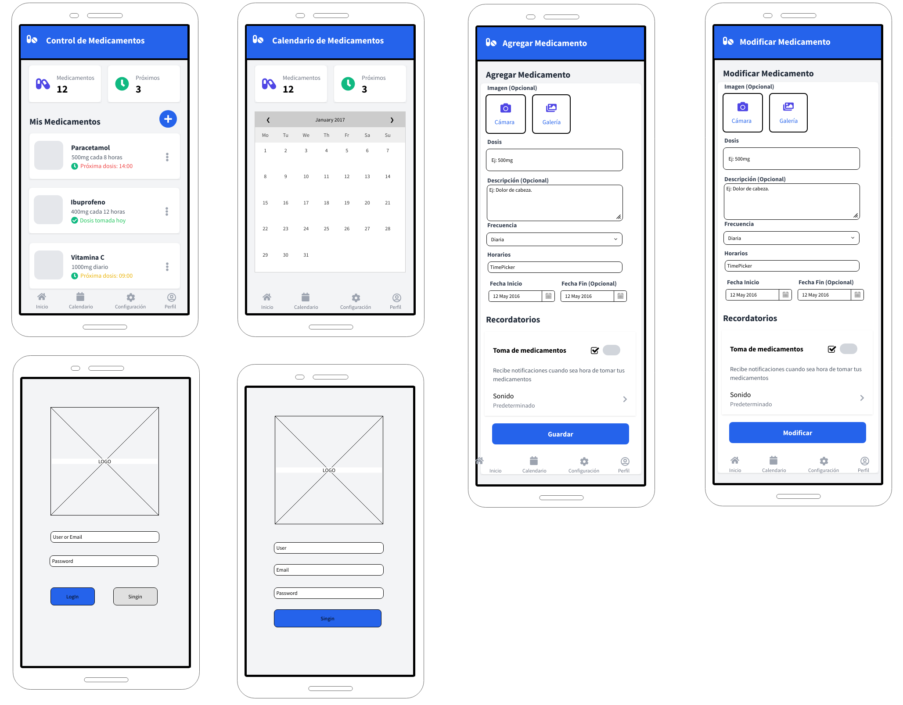

# Repositorio MediTrack
Aplicación móvil en Kotlin para gestionar medicamentos, con registro, recordatorios y soporte para imágenes desde cámara o galería (Proyecto Individual del Curso de Desarrollo Móvil).

# Api Service MediTrack
- Repositorio del codigo hecho en node node.js : https://github.com/Desarrollo-Movil-2k25/API-SERVICE_MediTrack
- Documentacion de la api https://esteban-609399.postman.co/workspace/My-Workspace~3b97e4a9-acef-4c7a-888c-0367e8ad0f55/collection/45666071-ae3a1cc4-6088-42b7-a11d-f52add062208?action=share&creator=45666071

# Idea de proyecto 
- Control de Medicamentos

# Descripción General
Esta idea consiste en una aplicación móvil desarrollada en **Kotlin** con **Android Studio**, diseñada para ayudar al usuario a gestionar de manera sencilla y eficiente el consumo de sus medicamentos. La aplicación permite registrar medicamentos con su nombre, dosis, imagen (tomada desde la cámara o seleccionada de la galería), y establecer recordatorios para recibir notificaciones cuando sea hora de tomarlos.  

# Objetivo General
Desarrollar una aplicación móvil que permita al usuario **registrar, visualizar, editar y eliminar medicamentos**, además de **configurar recordatorios automáticos** mediante notificaciones, con el fin de facilitar el control del consumo de medicamentos de forma ordenada y puntual.

# Objetivos Específicos
- Implementar operaciones **CRUD** (Crear, Leer, Actualizar y Eliminar) para la gestión de medicamentos.  
- Permitir agregar **imágenes** de los medicamentos, tanto desde la **cámara** como desde la **galería** del dispositivo.  
- Incorporar un sistema de **recordatorios automáticos** utilizando notificaciones locales.  
- Diseñar una **interfaz sencilla e intuitiva** que muestre la lista personalizada de medicamentos con sus datos relevantes.  
- (Opcional) Incluir un **historial** de medicamentos tomados o vencidos.  

# Autor
**Esteban Amores**  
Proyecto académico para el curso de **Desarrollo de Aplicaciones Móviles**.

# MackUps

# Paletas de Colores
- https://paletadecolores.com.mx/paleta/4180ab/ffffff/8ab3cf/bdd1de/e4ebf0
- https://paletadecolores.com.mx/paleta/3a3132/0f4571/386dbd/009ddd/05d3f8
- https://paletadecolores.com.mx/paleta/cecece/a2a2a2/777777/4b4b4b/202020
